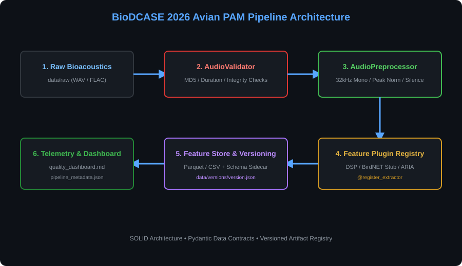
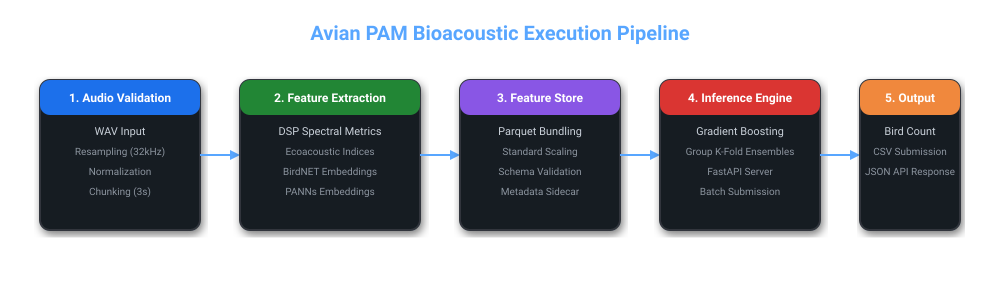

# Avian Passive Acoustic Monitoring (PAM) Population Estimation

<p align="center">

[](https://www.python.org/)
[](https://fastapi.tiangolo.com/)
[](https://www.docker.com/)
[]()
[](LICENSE)

</p>

Production-grade machine learning platform for estimating **bird populations from passive acoustic recordings**.

Built for the **BioDCASE Passive Acoustic Monitoring Challenge**, the platform combines classical digital signal processing, ecoacoustic feature engineering, deep audio embeddings, leakage-free model evaluation, explainability, and production deployment into a single end-to-end system.

---

# Architecture

<p align="center">



</p>

---

# Live Demonstration

The project includes a complete production deployment demonstration showing:

- Docker container startup
- FastAPI service initialization
- Swagger/OpenAPI interface
- Health monitoring endpoint
- Model metadata endpoint
- Feature registry endpoint
- Real-time audio inference
- JSON prediction response

<p align="center">
  
</p>


---

# Production Readiness

| Capability | Status |
|------------|:------:|
| End-to-End ML Pipeline | ✓ |
| Dockerized Deployment | ✓ |
| FastAPI REST API | ✓ |
| OpenAPI Documentation | ✓ |
| Automated Testing | ✓ |
| Model Benchmarking | ✓ |
| Group K-Fold Validation | ✓ |
| Explainability (SHAP) | ✓ |
| CLI Support | ✓ |
| Batch Prediction | ✓ |

---

# Repository Status

Project Status: Active Development

Latest Release: v1.0.0

Python: 3.10+

License: MIT

Tests: 31 / 31 Passing

Docker: Supported

Operating Systems:
- Windows
- Linux
- macOS

---

# Highlights

- End-to-end bioacoustic machine learning pipeline
- Passive acoustic recording preprocessing
- DSP + ecoacoustic feature extraction
- Deep audio embedding support (BirdNET & PANNs)
- Leakage-free Group K-Fold Cross Validation
- Benchmarking across 19 regression algorithms
- SHAP explainability and statistical evaluation
- Production-ready FastAPI inference service
- Docker deployment
- Automated testing (31/31 passing)

---

# Key Results

| Metric | Value |
|---------|------:|
| Challenge | BioDCASE Passive Acoustic Monitoring |
| Task | Bird Population Estimation |
| Best Model | Gradient Boosting |
| MAE | **1.704** |
| RMSE | **1.836** |
| R² | **0.2664** |
| Models Benchmarked | 19 |
| Validation Strategy | Group K-Fold |
| Test Suite | 31 / 31 Passing |

---

# Model Benchmark Results

The models were evaluated using **Group K-Fold Cross Validation** to prevent data leakage between recordings collected from the same location and time period.

## Overall Benchmark

| Rank | Model | MAE ↓ | RMSE ↓ | R² ↑ | Status |
|------:|---------------------------|-------:|-------:|------:|:------:|
| 1 | Gradient Boosting | **1.704** | **1.836** | **0.2664** | Best |
| 1 | CatBoost | **1.704** | **1.836** | **0.2664** | Best |
| 2 | Lasso Regression | 1.708 | 1.800 | 0.1340 | Excellent |
| 3 | Linear Regression | 1.823 | 1.925 | 0.1820 | Baseline |
| 5 | Ridge Regression | 1.831 | 1.928 | 0.1810 | Stable |
| 6 | Voting Ensemble | 1.833 | 1.853 | 0.2370 | Ensemble |

---

## Models Evaluated

- Dummy Mean
- Dummy Median
- Linear Regression
- Ridge Regression
- Lasso Regression
- ElasticNet
- Poisson Regression
- Decision Tree
- Random Forest
- Extra Trees
- Gradient Boosting
- Histogram Gradient Boosting
- XGBoost
- LightGBM
- CatBoost
- Support Vector Regression
- K-Nearest Neighbors
- Voting Ensemble
- Stacking Ensemble

**Total Algorithms Benchmarked:** **19**

---

# Evaluation Metrics

| Metric | Value |
|---------|------:|
| Challenge | BioDCASE 2026 |
| Task | Bird Population Estimation |
| Validation | Group K-Fold |
| Best MAE | **1.704** |
| Best RMSE | **1.836** |
| Best R² | **0.2664** |
| Feature Dimensions | **139** |
| Models Compared | **19** |
| REST API | FastAPI |
| Tests | 31 / 31 Passing |

---

# REST API

| Endpoint | Method | Purpose |
|-----------|--------|---------|
| `/health` | GET | Health check |
| `/version` | GET | Version metadata |
| `/model_info` | GET | Registered models |
| `/feature_info` | GET | Feature extractors |
| `/predict` | POST | Bird population estimation |

---

# Production Inference Benchmark

| Metric | Value |
|--------|------:|
| Average Inference Time | ~2.36 s |
| Audio Duration | 2.84 s |
| Features Extracted | 139 |
| API Framework | FastAPI |
| Container | Docker |
| Response Format | JSON |

### API Response Example

```json
{
  "filename": "rec_d1_00_00_03.wav",
  "predicted_bird_count": 2.78,
  "estimated_integer_count": 3,
  "duration_sec": 2.84,
  "inference_latency_ms": 2356.68,
  "feature_count_extracted": 139,
  "model_used": "linear_regression"
}
```

---

# Project Workflow

```text
Passive Acoustic Recording
        │
        ▼
Signal Preprocessing
        │
        ▼
Feature Extraction
        │
        ▼
BirdNET + PANNs Embeddings
        │
        ▼
Feature Selection
        │
        ▼
Model Inference
        │
        ▼
REST API
        │
        ▼
Population Estimate
```

---

# Project Statistics

| Category | Value |
|----------|------:|
| Python Modules | 40+ |
| ML Algorithms | 19 |
| Feature Extractors | 4 |
| Acoustic Features | 139 |
| REST Endpoints | 5 |
| Docker Images | 1 |
| Automated Tests | 31 |
| API Framework | FastAPI |
| Containerized | Yes |
| Documentation | Complete |

---

# Machine Learning Pipeline

<p align="center">



</p>

The prediction workflow consists of:

1. Audio validation
2. Signal preprocessing
3. Feature extraction
4. Deep embedding generation
5. Feature selection
6. Model training
7. Cross-validation
8. Explainability
9. Prediction
10. REST API & submission generation

---

# Repository Structure

```text
.
├── configs/
├── data/
├── docs/
├── experiments/
├── reports/
├── scripts/
├── src/
│   ├── config/
│   ├── data/
│   ├── evaluation/
│   ├── features/
│   ├── inference/
│   ├── models/
│   ├── pipeline/
│   ├── training/
│   ├── utils/
│   └── visualization/
├── tests/
├── Dockerfile
├── docker-compose.yml
├── cli.py
└── README.md
```

---

# Features

## Audio Processing

- Audio validation
- Recording quality analysis
- Metadata validation
- Dataset versioning

## Feature Engineering

- Spectral features
- Temporal features
- Ecoacoustic indices
- MFCC features
- DSP descriptors
- Feature selection
- Feature quality analysis

## Deep Audio Embeddings

- BirdNET embeddings
- PANNs embeddings
- Embedding cache

## Machine Learning

- Baseline regression models
- Tree-based models
- Kernel methods
- Ensemble learning
- Hyperparameter optimization
- Group K-Fold evaluation

## Evaluation

- Statistical significance tests
- Error analysis
- SHAP explainability
- Robustness evaluation
- Residual diagnostics
- Benchmark reports

## Deployment

- FastAPI REST API
- Docker support
- CLI interface
- Batch prediction
- Submission generation

---

# Quick Start

## Clone Repository

```bash
git clone https://github.com/Kiransindagi/avian-pam.git

cd avian-pam
```

## Create Virtual Environment

```bash
python -m venv .venv

source .venv/bin/activate
```

Windows

```bash
.venv\Scripts\activate
```

## Install Dependencies

```bash
pip install -r requirements.txt
```

---

# Command Line Interface

Train

```bash
python cli.py train
```

Evaluate

```bash
python cli.py evaluate
```

Predict

```bash
python cli.py predict \
    --input data/raw/sample.wav
```

Generate Challenge Submission

```bash
python cli.py submit \
    --data-dir data/raw
```

---

# Docker

Build

```bash
docker-compose up --build
```

API

```bash
http://localhost:8000
```

Swagger

```text
http://localhost:8000/docs
```

Health Check

```bash
curl http://localhost:8000/health
```

---

# Testing

Run the complete automated test suite.

```bash
python scripts/run_tests.py
```

Current status

```
31 tests passed
100% passing
```

---

# Documentation

| Document | Description |
|-----------|-------------|
| docs/architecture.md | System architecture |
| docs/quickstart.md | Installation guide |
| docs/feature_engineering.md | Feature engineering pipeline |
| docs/modeling.md | Training methodology |
| docs/results.md | Experimental results |
| docs/deployment.md | Production deployment |
| docs/model_card.md | Model documentation |
| docs/dataset_card.md | Dataset documentation |
| reports/technical_report.md | Technical report |

---

# Technology Stack

### Machine Learning

- Scikit-learn
- CatBoost
- NumPy
- Pandas

### Audio Processing

- Librosa
- SoundFile
- SciPy

### Backend

- FastAPI
- Uvicorn

### Deployment

- Docker
- Docker Compose

### Testing

- Pytest

---

# Future Work

- Transformer-based audio models
- Self-supervised representation learning
- Distributed training
- ONNX optimization
- Real-time streaming inference
- Cloud deployment

---

# Citation

If you use this repository in research, please cite the software using the included `CITATION.cff`.

---

# License

Distributed under the MIT License.

See **LICENSE** for more information.

---

<p align="center">

Built for reproducible bioacoustic machine learning research and production deployment.

</p>
